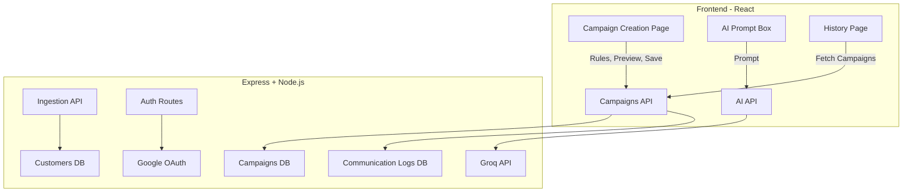

# Xeno SDE Internship Assignment 2025 – Mini CRM

🚀 A Mini CRM platform built as part of the **Xeno SDE Internship Assignment 2025**.  
This project demonstrates **customer segmentation, personalized campaign delivery, authentication, and AI integration** with a clean React + Express + MongoDB stack.

---

## ✨ Features Implemented

### 1. Data Ingestion APIs
- **`POST /api/ingest/customers`**
  - Bulk upsert customers by email.
  - Accepts `{ name, email, totalSpends, visits }`.
- **`POST /api/ingest/orders`**
  - Adds orders linked to customers.
  - Updates aggregates: `totalSpends += amount`, `visits += 1`.
- Ensures clean validation and predictable updates.
- Tested via Postman and directly in-app.

### 2. Campaign Creation UI
- Built with **React (Vite + React Router)**.
- Dynamic rule builder:
  - Fields: `spend`, `visits`, `lastVisitDays`.
  - Operators: `>`, `<`, `=`, `>=`, `<=`, `!=`.
  - Conjunction: `AND` / `OR`.
- Preview audience size before saving.
- Save & Launch → triggers campaign creation + delivery process.

### 3. Campaign Delivery & Logging
- **Simulated delivery**:
  - ~90% messages marked `SENT`, ~10% `FAILED`.
- **Personalized messages** (demo logs):
  - Example:  
    `"Hi Mohit, here’s 10% off on your next order!"`
- **Delivery Receipt API** updates `CommunicationLog`.
- Campaign History shows:
  - Audience size
  - Sent / Failed counts
  - Rule summary & expandable JSON view
  - Created timestamp

### 4. Authentication
- **Google OAuth 2.0** via Passport.js.
- Only logged-in users can:
  - Create campaigns
  - View history
- **Login page**:
  - Clean green "Login with Google" button.
- **Navbar**:
  - Hidden on `/login`.
  - Shows Logout when logged in.

### 5. AI Integration (Groq API)
- Natural language → rules conversion.
- Backend route: `POST /api/ai/generate-rules`
- Example:
  - Input:  
    `"customers who spent more than 10000 and visited less than 5 times"`
  - Output:  
    ```json
    {
      "conjunction": "AND",
      "rules": [
        { "field": "spend", "operator": ">", "value": "10000" },
        { "field": "visits", "operator": "<", "value": "5" }
      ]
    }
    ```
- Powered by **Groq LLM API** (`llama-3.1-8b-instant`).

---

## 🛠️ Tech Stack

- **Frontend:** React (Vite), React Router
- **Backend:** Node.js (Express)
- **Database:** MongoDB (Mongoose ODM)
- **Auth:** Google OAuth 2.0 (Passport.js)
- **AI:** Groq API
- **Styling:** Custom CSS (dark theme, consistent with campaign flow)

---

## 🏗️ Architecture



##           ⚙️ Local Setup

### Prerequisites
- Node.js >= 18  
- MongoDB (Atlas or local)

### 1. Clone repo
```bash
git clone https://github.com/KindaJayant/xeno-crm-assignment.git
cd xeno-crm-assignment

### 2. Backend

```bash
cd server
npm install
cp .env.example .env
````

Fill `.env`:

```env
PORT=5000
MONGO_URI=your-mongodb-uri
SESSION_SECRET=your-session-secret
GOOGLE_CLIENT_ID=xxxx.apps.googleusercontent.com
GOOGLE_CLIENT_SECRET=xxxx
GROQ_API_KEY=gsk_xxx
```

Run:

```bash
npm run dev
```

---

### 3. Frontend

```bash
cd client
npm install
npm run dev
```

Open: [http://localhost:5173](http://localhost:5173)

---

## 🔐 Authentication Flow

1. User clicks **Login with Google**.
2. Redirects to `/auth/google` on backend.
3. OAuth flow → stores session with Passport.
4. Frontend guarded with `ProtectedRoute`:

   * `/` (Create Campaign) → requires login
   * `/history` (Campaign History) → requires login
   * `/login` → always public (no Navbar)

---

## 📊 Screenshots

* **Campaign Creation Page:** AI input, dynamic rules, preview & launch.
* **Campaign History Page:** Audience, Sent/Failed, rules, created date.
* **Login Page:** Green Google login button.

---

## 🧠 AI Notes

* **Model:** `llama-3.1-8b-instant` on **Groq API**
* **Chosen for:** fast responses, public API, assignment requirement
* **Integration:** natural-language → JSON rules

---

## 🚧 Known Limitations

* Delivery is simulated (\~90% success)
* Personalized messages logged in backend, not shown in UI
* No batch consumer for delivery receipts (direct writes instead)
* No Swagger UI (tested via Postman)

---

## 📦 Deployment (Planned)

* **Backend:** Render or Railway (Node.js + MongoDB Atlas)
* **Frontend:** Vercel or Netlify
* **CORS:** configured for frontend origin
* **Env Vars:** set in hosting dashboards

---

## 🎥 Demo Video (Planned)

* **Duration:** 5–7 minutes
* **Flow:**

  1. Login with Google
  2. Create campaign (manual + AI rules)
  3. Preview audience
  4. Save & launch (backend logs personalized messages)
  5. History shows stats
  6. Walkthrough architecture & AI integration

---

## 📝 Evaluation Mapping

* **Data Ingestion APIs:** ✅ implemented
* **Campaign Creation UI:** ✅ rule builder, preview, save, AI assist
* **Campaign Delivery & Logging:** ✅ simulated vendor, delivery receipt, stats
* **Authentication:** ✅ Google OAuth, route protection, conditional Navbar
* **AI Integration:** ✅ natural language → rules with Groq
* **README, Deployment, Video:** 🚧 in progress

---

## 👨‍💻 Author

**Jayant 👑**
Thapar Institute of Engineering & Technology
B.E. Computer Science & Business Systems

```

